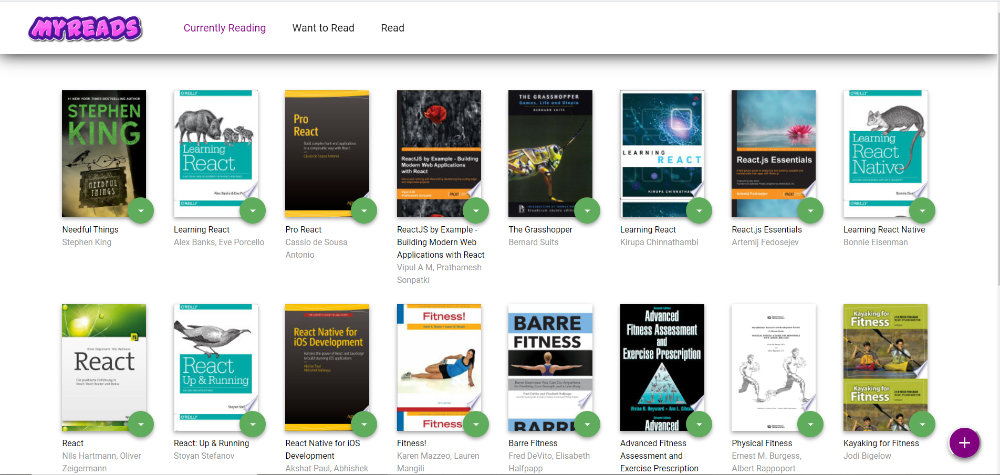
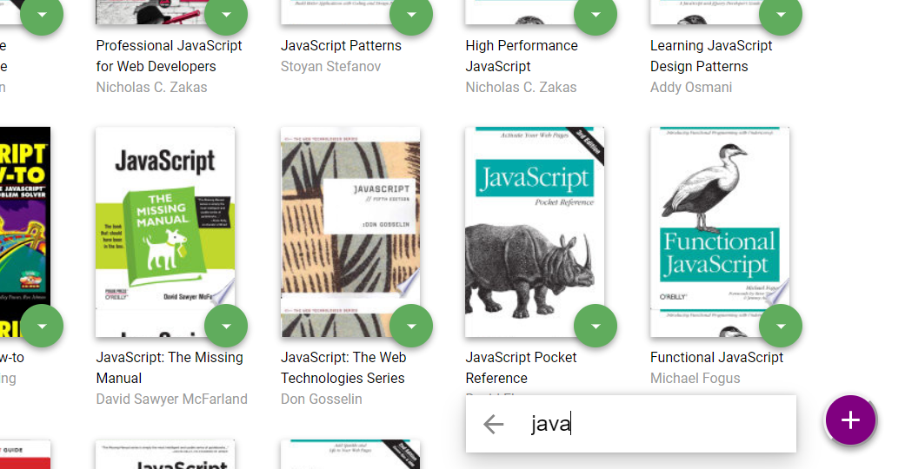

# MyReads

MyReads is a simple cataloging app that allows you to place books in one of three shelves or categories:
- Currently Reading
- Want to Read
- Read

It also allow you to search for books based on title and author.

Attached [screenshots](#screenshots) below.

## Installation

Clone the repository, change directories, and use NPM to install the dependencies.

```bash
$ git clone https://github.com/Amrindersingh1/MyReads.git
$ cd MyReads
$ npm install
```

## Usage

To run the project:

- `npm start`

Than project can be viewed in the browser at:

- [http://localhost:3000](http://localhost:3000)

## Screenshots




